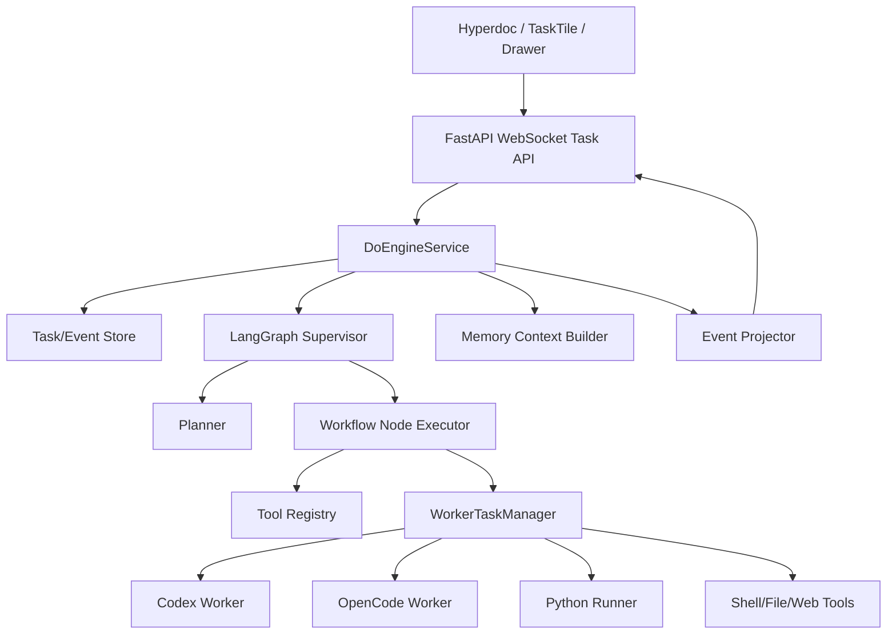

# Do 引擎现状分析与目标设计

> 本文聚焦“做事引擎 / 编排 Agent / Do Engine”，不是泛泛解释 LangGraph。
> 目标是回答三个问题：
>
> 1. 当前项目里的编排 Agent 到底已经做了什么。
> 2. 对比 `CodeReference/DeepTutor` 与 `CodeReference/nanobot`，现状错在哪里，应该抄哪些设计。
> 3. 结合 V5 任务书，Do 引擎应该迭代成什么样，后端接口和前端呈现如何验收。

## 1. 我们真正想要的 Do 引擎

从任务书和产品期望看，Do 引擎不是一个普通聊天接口，也不是只会返回一段答案的 Agent。

它应该是一个“聪明的电脑任务编排器”：

- 上层通过 FastAPI / WebSocket / SSE 和前端协作。
- 中层理解用户意图，拆解复杂任务，形成可观察的 workflow。
- 下层调度本机强工具：Codex、OpenCode、Python Runner、Shell、文件系统、搜索、RAG、自带工具。
- 执行过程中可以异步并行、等待用户、被打断、恢复、重试、审查。
- 每一步都能实时投影到 Hyper 文档右侧的任务磁贴、drawer 进度、日志、产物列表。
- 任务完成后能把结果写回文档，例如 `task_result` 节点、实验报告、代码产物、PDF、图表。

一个理想例子：

```text
用户在 Hyperdoc 中输入：
/task 完成一个机器学习实验：调研数据集，写 sklearn 实验代码，跑出结果，生成 PDF 报告，并审查代码可靠性

前端立即出现任务磁贴：
1. Agent 调研数据集
2. OpenCode/Codex 委托代码实现
3. Python Runner 执行实验
4. Codex 审查代码与 PDF
5. 汇总并写回文档

右侧 drawer 显示：
- 当前节点、历史节点、子任务状态
- 工具调用日志
- worker stdout/stderr 摘要
- 产物：代码、csv、png、pdf
- 失败原因、重试按钮、继续输入入口
```

所以 Do 引擎的核心价值不是“能不能调用一次工具”，而是：

- 把复杂任务变成可执行、可观察、可恢复的工作流。
- 把每个 worker 和工具调用变成前端能看懂的任务节点。
- 把长任务从“黑盒等待”变成“持续可解释的动态过程”。

## 2. 当前项目现状

### 2.1 后端已有模块

当前项目已经有一套 V5 编排基础，不是空的。

核心位置：

- `backend/server/app.py`
  - WebSocket 编排入口：`/ws/orchestrator`
  - HTTP / SSE 聊天入口：`/api/chat/stream`
  - runner 分发逻辑
- `backend/runtime/graph.py`
  - LangGraph 状态图
  - 节点：`planning -> tools -> await_user -> verify -> finalize`
- `backend/runtime/runtime.py`
  - `OrchestratorRuntime`
  - 负责创建 session、调用 graph、发事件
- `backend/runtime/planner.py`
  - planner LLM 调用与工具调用循环
- `backend/tools/registry.py`
  - 注册工具：文件、shell、web、await_user、delegate_task、delegate_opencode、query_database
- `backend/tools/delegate.py`
  - 委托 Codex / OpenCode worker
  - worker 失败后尝试 fallback
- `backend/workers/codex_worker.py`
  - 调用本机 `codex`
- `backend/workers/opencode_worker.py`
  - 调用本机 `opencode`
- `backend/workers/selection.py`
  - 根据任务关键词选择 Codex 或 OpenCode
- `backend/runners/python_runner.py`
  - 运行 Python 代码
  - 对 sklearn 线性回归 demo 有特殊兜底
- `backend/runners/router.py`
  - runner 名称分发：`shell`、`python_runner`、`codex_cli`、`opencode_cli`、`orchestrator`

### 2.2 当前协议能力

V5 WebSocket 协议文档在：

- `docs/BackEndA/orchestrator-v5-protocol.md`

当前设计的核心方法：

- `orchestrator.task.create`
- `orchestrator.task.resume`
- `orchestrator.task.interrupt`

核心事件：

- `orchestrator.task.step`
- `orchestrator.task.awaiting_user`
- `orchestrator.task.result`

任务事件字段里已经有：

- `task_id`
- `doc_id`
- `phase`
- `status`
- `summary`
- `active_worker`
- `worker_runs`
- `artifacts`

这说明当前系统已经知道“任务”和“worker”的概念，也已经有前端可订阅的任务事件。

### 2.3 当前前端对接现状

前端已有 V5 任务流接入点：

- `TutorGridFront/src/stores/orchestratorStore.ts`
  - 连接 `ws://127.0.0.1:3210/ws/orchestrator`
  - 发送 `orchestrator.task.create/resume/interrupt`
  - 接收 WebSocket frame
- `TutorGridFront/src/stores/orchestratorTaskStore.ts`
  - 维护任务状态
  - 消费 `orchestrator.task.step/awaiting_user/result`
  - 按 `doc_id` 关联任务
- `TutorGridFront/src/views/document/components/TileGrid.vue`
  - 渲染右侧磁贴网格
- `TutorGridFront/src/views/document/components/TaskTile.vue`
  - 展示任务当前阶段、进度、摘要、继续/中断按钮

但当前前端任务磁贴主要是固定四阶段：

```text
规划任务 -> 执行工具 -> 验证结果 -> 整理输出
```

它还不是“动态 workflow 磁贴”：

- 不能展示 planner 真实拆出来的多个语义节点。
- 不能展示多个 worker 并发执行。
- drawer 里的节点进度、日志、产物、审查结果还没有形成完整产品闭环。
- Hyperdoc 中 `/task` 到 `task_register`、`task_result` 的写回链路需要继续验收。

### 2.4 当前验证结果

已有自动化测试能跑通一部分基础能力：

```text
python -m unittest tests.test_websocket_e2e tests.test_delegate_runtime tests.test_python_runner tests.test_interrupt_runtime tests.test_worker_selection

Ran 21 tests ... OK
```

这些测试说明：

- WebSocket 基础协议有测试。
- delegate runtime 有测试。
- Python runner 有测试。
- interrupt runtime 有测试。
- worker 选择逻辑有测试。

但这并不等于真实 Do 引擎已经可用，因为这些测试更多覆盖 fake worker、协议、局部 runner。

当前真实 orchestrator 路径存在关键问题：

```text
python -m backend.dev.run_runtime "请介绍一下线性回归是什么，不需要读文件" --workspace scratch/runtime_smoke

ValueError: too many values to unpack (expected 2)
```

问题位置在 `backend/runtime/runtime.py` 的 LangGraph streaming 消费逻辑。

当前代码按：

```python
async for mode, payload in graph.astream(...):
```

去拆包。但当前环境的 LangGraph v2 streaming 返回结构不是稳定的 `(mode, payload)` 二元组，而是统一 stream part / dict 形态。官方 LangGraph streaming 文档也强调 v2 event stream 是带 `type/data` 的事件结构。

这意味着：

- 单元测试 OK 不代表真实 LLM 编排 OK。
- 当前 LangGraph 真实路径在本环境会直接炸。
- 如果前端任务走了 Python runner 特判，可能看起来“能跑 sklearn demo”；但这绕开了真正的 orchestrator LLM graph。

另一个已发现配置风险：

```json
{
  "model": "deepSeek-V4-pro"
}
```

DeepSeek OpenAI-compatible 接口返回的模型名是小写：

```text
deepseek-v4-pro
```

如果模型名大小写不精确，Chat SSE 和 planner LLM 都可能出现：

```text
HTTP 400: The supported API model names are ...
```

所以当前失败不只是“API Key 问题”，而是：

- 模型名配置不匹配。
- ChatAgent 单例初始化后需要重启服务。
- LangGraph streaming 消费方式与版本不匹配。

## 3. 当前 Do 引擎到底做了什么

通俗讲，现在这个编排 Agent 做了这些事：

1. 收到一个任务。
2. 建立 session 和 runtime state。
3. 进入 LangGraph：planning。
4. planner LLM 判断下一步要不要调用工具。
5. 如果要读文件、跑 shell、web fetch、委托 Codex/OpenCode，就生成 tool call。
6. tools 节点执行工具。
7. 如果需要用户输入，进入 await_user。
8. 如果需要验证，进入 verify。
9. 最后 finalize，向前端发 result。

所以它已经像一个“有工具调用能力的循环 Agent”。

但是它还不像一个“产品级任务编排器”。

最核心差别是：

```text
现在：
用户任务 -> 一个 LangGraph loop -> 若干工具调用 -> 固定阶段事件 -> 最终结果

理想：
用户任务 -> planner 生成 workflow DAG -> 多个可观察节点 -> worker 异步执行 -> 每个节点可暂停/恢复/重试/审查 -> 产物写回文档
```

当前更像“Agent loop 的骨架”，不是完整 Do Engine。

## 4. 与 nanobot 对比：应该抄什么

参考仓库：

- `CodeReference/nanobot`

重点文件：

- `nanobot/agent/loop.py`
- `nanobot/agent/runner.py`
- `nanobot/agent/subagent.py`
- `nanobot/agent/tools/registry.py`
- `nanobot/agent/tools/spawn.py`
- `nanobot/api/server.py`

### 4.1 AgentLoop 与 AgentRunner 分层

nanobot 的结构很清楚：

- `AgentLoop`
  - 面向产品和会话。
  - 接收消息、构建上下文、接入 memory/skills/history、对接 message bus。
- `AgentRunner`
  - 面向纯 Agent 执行。
  - 负责 LLM 调用、工具调用、iteration、checkpoint、tool result、错误恢复。

我们当前的问题是：

- `OrchestratorRuntime`、LangGraph graph、planner、tool execution、session 事件投影混在一起。
- 代码能跑局部测试，但产品语义不够清楚。

应该借鉴：

```text
DoEngineService        产品层：任务、文档、前端事件、用户记忆
DoGraphRunner          执行层：LangGraph 状态机、checkpoint、interrupt
AgentToolRunner        工具层：工具调用、预算、错误恢复
WorkerTaskManager      异步 worker 层：Codex/OpenCode/Python 子任务
EventProjector         投影层：把内部状态转成前端节点事件
```

### 4.2 SubagentManager：真正的后台任务模型

nanobot 的 `SubagentManager` 是当前最值得抄的一块。

它有：

- `SubagentStatus`
  - `task_id`
  - `label`
  - `task_description`
  - `started_at`
  - `phase`
  - `iteration`
  - `tool_events`
  - `usage`
  - `stop_reason`
  - `error`
- `spawn()`
  - 创建 `asyncio.create_task(...)`
  - 记录 `_running_tasks`
  - 记录 `_task_statuses`
  - 按 session 关联 `_session_tasks`
- `_run_subagent()`
  - 子 agent 有自己的工具注册表
  - 子 agent 通过 checkpoint 更新状态
  - 完成后向原会话宣布结果

这正好对应我们想要的：

```text
Agent 调研 -> 后台 subtask
Codex 委托代码 -> 后台 worker task
OpenCode 实现 -> 后台 worker task
Python Runner 执行 -> 后台 runner task
Codex 审查 PDF -> 后台 review task
```

当前我们的 `delegate_task` 更像“同步工具调用”：

- planner 调用 delegate tool。
- tool 内部运行 worker。
- worker 完成后返回一段结果。

它没有变成一等后台任务：

- 没有独立 `node_id`。
- 没有独立状态生命周期。
- 没有可订阅的 worker progress。
- 没有真正的并发 workflow 调度。
- 没有子任务列表给 drawer 渲染。

应该把 nanobot 的 `SubagentManager` 思路迁移成：

```text
WorkerTaskManager
- spawn_worker(node_id, worker_kind, prompt, workspace)
- get_status(worker_run_id)
- cancel(worker_run_id)
- stream_events(worker_run_id)
- attach_artifacts(worker_run_id)
- announce_result_to_task(task_id, node_id)
```

### 4.3 Hook / Checkpoint / Tool Events

nanobot 的 `AgentRunner` 支持：

- `checkpoint_callback`
- `progress_callback`
- `retry_wait_callback`
- `injection_callback`
- hook before/after tool execution
- 每轮 iteration 后记录 tool events 和 usage

这比我们现在的 `orchestrator.task.step` 更细。

我们应该抄：

- 每次 planner 生成计划时发 checkpoint。
- 每次 tool_call 开始/结束时发 tool event。
- 每个 worker 进度变更时发 worker event。
- 每次用户插入新消息时能被 injection callback 消化。

这能解决“动态异步双线程执行”：

- 主 Agent 继续规划/解释。
- 后台 worker 干活。
- 用户可以中途追加要求。
- 前端一直有可回放事件流。

### 4.4 ToolRegistry 的工具治理

nanobot 的工具注册表不是简单 dict，它负责：

- register / unregister
- 工具定义稳定排序
- 参数准备和校验
- 工具错误转成可给 LLM 看的 hint

我们现在已有 `backend/tools/registry.py`，但还偏基础。

应该增强：

- 每个工具有 schema、权限、展示名、前端图标、是否可并发、是否会产生 artifact。
- 每个工具调用生成 `tool_call_id`。
- 参数校验失败也要成为前端可见事件。
- 工具结果要有 `summary` 和 `raw` 两层，避免 drawer 被大段 stdout 淹没。

## 5. 与 DeepTutor 对比：应该抄什么

参考仓库：

- `CodeReference/DeepTutor`

重点文件：

- `deeptutor/api/routers/unified_ws.py`
- `deeptutor/services/session/turn_runtime.py`
- `deeptutor/agents/chat/agentic_pipeline.py`
- `deeptutor/agents/solve/main_solver.py`
- `deeptutor/agents/solve/tool_runtime.py`
- `deeptutor/services/memory/service.py`
- `web/lib/unified-ws.ts`
- `web/components/chat/home/TracePanels.tsx`
- `web/components/common/ProcessLogs.tsx`

### 5.1 统一 WS：turn、seq、订阅、恢复、取消

DeepTutor 的 `/api/v1/ws` 支持：

- `message` / `start_turn`
- `subscribe_turn`
- `subscribe_session`
- `resume_from`
- `unsubscribe`
- `cancel_turn`
- `regenerate`

前端 `UnifiedWSClient` 保存：

- `activeTurnId`
- `lastSeq`

断线后自动发：

```ts
{
  type: "resume_from",
  turn_id: activeTurnId,
  seq: lastSeq
}
```

这对我们很重要。

我们现在有 task_id，但缺少强语义的 seq/replay 事件流。右侧 drawer 如果要可靠显示长任务进度，就不能只靠“当前连接收到什么算什么”。

应该补：

```text
task_event.seq
task_event.timestamp
task_event.turn_id / run_id
subscribe_task(task_id, after_seq)
subscribe_doc(doc_id, after_seq)
resume_from(task_id, seq)
```

这样前端刷新、断线、切文档回来，都能恢复完整进度。

### 5.2 AgenticChatPipeline：阶段清楚，trace 清楚

DeepTutor 的 chat pipeline 明确拆成：

- thinking
- acting
- observing
- responding

并通过 `StreamBus` 发：

- `stage_start`
- `stage_end`
- `thinking`
- `observation`
- `content`
- `tool_call`
- `tool_result`
- `progress`
- `sources`
- `result`
- `error`
- `done`

这给前端 trace panel 很稳定的输入。

我们现在的阶段：

```text
planning / tools / verify / finalize
```

更像后端内部状态，不够产品化。

应该区分：

- 后端内部 phase：LangGraph 运行用。
- 前端 workflow node：用户看得懂。
- trace event：展示细节。

例如：

```text
内部 phase = tools
前端 node = "运行 sklearn 实验代码"
trace event = tool_call: python_runner, stdout: "...", artifact: result.png
```

### 5.3 MainSolver：Plan -> ReAct -> Write

DeepTutor 的 solve 线不是让一个 Agent 自由乱跑，而是：

```text
PlannerAgent -> SolverAgent(ReAct per step) -> WriterAgent
```

并且每步都有 scratchpad：

- plan steps
- step status
- thought
- action
- observation
- self_note
- replan

这非常适合我们 Do 引擎的“复杂任务拆解”。

我们应该抄它的思想，而不是照搬代码：

```text
Plan:
  生成 workflow nodes

Act:
  对每个 node 执行工具 / worker
  支持 done / replan / ask_user / retry

Review:
  验证产物、审查代码、检查报告

Write:
  汇总结果，写回 Hyperdoc
```

### 5.4 ToolRuntime：工具白名单和控制动作

DeepTutor 的 `SolveToolRuntime` 有两个重要设计：

- enabled_tools 白名单
- 控制动作：`done`、`replan`

当前我们 planner prompt 里虽然告诉模型可以调用工具，但任务级控制动作还不够一等。

应该把这些动作协议化：

```text
done(node_id, evidence)
replan(task_id, reason)
ask_user(node_id, question)
retry(node_id, reason)
skip(node_id, reason)
delegate(node_id, worker_kind, prompt)
```

这样 LLM 不只是“调用工具”，而是在操作一个 workflow。

### 5.5 MemoryService：公开记忆与上下文构建

DeepTutor 的 memory service 是两文件模型：

- `SUMMARY.md`
- `PROFILE.md`

它提供：

- read snapshot
- build memory context
- refresh from turn
- profile / summary 分离

这比“随便把历史塞给 prompt”更可控。

我们的 Do 引擎也应该有 task-aware memory：

- 用户偏好：喜欢 Codex 还是 OpenCode。
- 项目偏好：测试命令、启动命令、编码规范。
- 任务记忆：这次 workflow 已经做过什么、失败过什么。
- 文档记忆：当前 Hyperdoc 任务节点和结果节点。

### 5.6 前端 TracePanels / ProcessLogs

DeepTutor 前端做了两类很实用的呈现：

- `TracePanels.tsx`
  - 把 `tool_call/tool_result/progress/thinking/observation` 分层显示。
  - 区分 summary progress 和 raw logs。
- `ProcessLogs.tsx`
  - 可折叠日志面板。
  - 自动滚到底。
  - 显示日志数量和运行状态。

我们的 TaskTile/drawer 应该借鉴：

- 磁贴只显示摘要和当前节点。
- drawer 展示完整 trace。
- raw stdout/stderr 默认折叠。
- tool args、tool result、artifact 独立展示。
- 失败节点直接显示错误与重试入口。

## 6. 现状错在哪里

### 6.1 把“任务协议”误当成“Do 引擎”

现在有：

- task create
- task step
- task result
- fixed phases

但缺少：

- workflow graph
- node lifecycle
- async worker lifecycle
- event replay
- artifact ownership
- front-end drawer projection model

也就是说，现在更像“任务包装过的 Agent loop”，不是完整 Do Engine。

### 6.2 LangGraph 接入目前不稳

当前真实 orchestrator smoke 已经暴露：

```text
ValueError: too many values to unpack (expected 2)
```

这说明 LangGraph streaming API 适配没有验收透。

如果这条路径不修，前端看到的“可以编排调度”很可能来自：

- Python runner 特判。
- fake worker 测试。
- 局部 demo。

而不是真正的 LLM 编排器稳定运行。

### 6.3 Worker 被当成同步工具，不是一等异步任务

当前 `delegate_task` 是工具。

理想中，Codex/OpenCode/Python Runner 应该是可观察的 worker run：

- started
- stdout/stderr progress
- artifact created
- completed
- failed
- cancelled

并且可以并行、取消、恢复、审查。

### 6.4 固定四阶段不够表达复杂任务

固定：

```text
规划任务 -> 执行工具 -> 验证结果 -> 整理输出
```

只能表达“当前 Agent 在哪一段”。

但真实复杂任务需要：

```text
调研资料
读取项目代码
委托 OpenCode 实现
运行 Python 实验
生成 PDF
审查代码
修复问题
写回文档
```

这些都应该是动态 node，而不是塞进一个 `tools` phase。

### 6.5 前端还没有拿到足够事件

当前 TaskTile 能展示当前阶段，但不够支撑“Hyper 文档 + 动态磁贴 + drawer”：

- 缺少节点列表。
- 缺少 worker run 列表的实时更新。
- 缺少 raw logs / summary logs 分层。
- 缺少产物卡片。
- 缺少 replay after seq。
- 缺少失败节点的局部重试。

### 6.6 测试没有覆盖真实产品链路

现在必须补真实验收：

- 真实 LLM planner。
- 真实 LangGraph streaming。
- 真实 Codex/OpenCode CLI。
- 真实 WebSocket 前端事件。
- 真实 Hyperdoc task 插入和 result 写回。

否则“单元测试 OK”会掩盖产品主路径不可用。

## 7. 推荐目标架构

### 7.1 总体结构



### 7.2 一等数据模型

建议新增或明确以下模型。

#### DoTask

```ts
interface DoTask {
  task_id: string
  doc_id?: string
  session_id: string
  title: string
  user_goal: string
  status: "pending" | "running" | "awaiting_user" | "completed" | "failed" | "cancelled"
  current_node_id?: string
  created_at: string
  updated_at: string
}
```

#### DoWorkflow

```ts
interface DoWorkflow {
  task_id: string
  version: number
  nodes: DoNode[]
  edges: { from: string; to: string; kind?: "normal" | "fallback" | "retry" }[]
}
```

#### DoNode

```ts
interface DoNode {
  node_id: string
  task_id: string
  kind:
    | "plan"
    | "research"
    | "inspect_workspace"
    | "delegate_codex"
    | "delegate_opencode"
    | "python_execute"
    | "review"
    | "ask_user"
    | "summarize"
    | "writeback"
  title: string
  description?: string
  status: "pending" | "running" | "awaiting_user" | "done" | "failed" | "cancelled" | "skipped"
  progress?: number
  worker_run_ids?: string[]
  artifact_ids?: string[]
  started_at?: string
  ended_at?: string
  error?: string
}
```

#### WorkerRun

```ts
interface WorkerRun {
  worker_run_id: string
  node_id: string
  worker_kind: "codex" | "opencode" | "python_runner" | "shell" | "subagent"
  status: "queued" | "running" | "completed" | "failed" | "cancelled"
  command?: string
  prompt?: string
  stdout_tail?: string
  stderr_tail?: string
  artifacts?: Artifact[]
  started_at?: string
  ended_at?: string
  error?: string
}
```

#### Artifact

```ts
interface Artifact {
  artifact_id: string
  task_id: string
  node_id?: string
  worker_run_id?: string
  kind: "file" | "image" | "pdf" | "code" | "table" | "markdown" | "log"
  path?: string
  title: string
  summary?: string
  metadata?: Record<string, unknown>
}
```

### 7.3 事件协议

建议在现有 V5 上扩展，而不是推倒重来。

新增事件：

```text
orchestrator.task.workflow.created
orchestrator.task.workflow.updated
orchestrator.task.node.started
orchestrator.task.node.progress
orchestrator.task.node.completed
orchestrator.task.node.failed
orchestrator.task.worker.started
orchestrator.task.worker.progress
orchestrator.task.worker.completed
orchestrator.task.worker.failed
orchestrator.task.artifact.created
orchestrator.task.log
orchestrator.task.snapshot
orchestrator.task.result
```

每个事件都带：

```json
{
  "type": "orchestrator.task.node.progress",
  "task_id": "...",
  "doc_id": "...",
  "seq": 42,
  "timestamp": "...",
  "node_id": "...",
  "payload": {}
}
```

新增请求：

```text
orchestrator.task.subscribe
orchestrator.task.resume_from
orchestrator.task.cancel
orchestrator.task.retry_node
orchestrator.task.user_input
orchestrator.task.snapshot
```

### 7.4 LangGraph 应该怎么用

LangGraph 适合做这件事，但不能只用成一个固定四节点 loop。

LangGraph 适合负责：

- supervisor state machine
- checkpoint
- interrupt / resume
- planner -> executor -> verifier -> writer 的状态流转
- 人机协作等待

LangGraph 不应该单独承担：

- 前端事件协议。
- worker 进程生命周期。
- artifact 管理。
- WebSocket replay。
- 大量 stdout/stderr 日志持久化。

这些应该由 DoEngineService / WorkerTaskManager / EventStore 负责。

建议图结构：

```text
ingest
  -> build_context
  -> plan_workflow
  -> schedule_ready_nodes
  -> wait_workers_or_user
  -> verify_node_results
  -> maybe_replan
  -> finalize_writeback
```

其中 `schedule_ready_nodes` 可以启动多个后台 worker；LangGraph checkpoint 只记录“启动了哪些 worker、当前等待哪些结果”，不要阻塞成黑盒。

## 8. 前端目标呈现

### 8.1 Hyperdoc 文档内

文档内应该插入轻量任务节点：

```text
task_register
- task_id
- title
- status
- current_summary
```

任务完成后插入：

```text
task_result
- final_answer
- artifacts
- citations / files
- replay link
```

### 8.2 右侧磁贴

磁贴不是完整日志，只做快速认知：

- 任务标题。
- 当前节点。
- 总状态。
- 进度条。
- 最近一条 summary。
- 关键产物数量。
- 失败/等待用户状态。

动态任务节点可以渲染成多个小卡：

```text
[调研] running
[代码实现] queued
[运行实验] pending
[审查 PDF] pending
```

### 8.3 Drawer

drawer 是完整过程视图：

- Workflow timeline。
- Node detail。
- Worker run detail。
- Tool call / tool result。
- Process logs。
- Artifacts。
- User input / resume。
- Retry / cancel。

建议布局：

```text
Header:
  title, status, elapsed, cancel/resume

Workflow:
  dynamic node list / DAG-lite timeline

Current Node:
  summary, progress, active worker

Trace:
  thinking / tool_call / tool_result / observation

Logs:
  stdout/stderr raw logs, collapsible

Artifacts:
  pdf, image, code, markdown, table
```

## 9. 迭代路线

### 第 0 阶段：修主路径阻断

目标：真实 orchestrator 能稳定跑。

必须做：

- 修正 DeepSeek model 配置为精确模型名，如 `deepseek-v4-pro`。
- 修 `backend/runtime/runtime.py` 的 LangGraph v2 stream 消费逻辑。
- 锁定/记录 LangGraph 版本。
- 增加真实 smoke：

```text
python -m backend.dev.run_runtime "请介绍一下线性回归是什么，不需要读文件" --workspace scratch/runtime_smoke
```

验收：

- 不报 `too many values to unpack`。
- 能输出 planning/tool/final result 事件。
- 前端能收到 `orchestrator.task.result`。

### 第 1 阶段：Workflow / Node Schema

目标：从固定 phase 升级成动态 workflow。

必须做：

- planner 输出 `DoWorkflow`。
- 后端保存 nodes / edges。
- 发 `workflow.created`。
- 每个 node 发 started/progress/completed/failed。
- 前端 TaskTile 从固定四阶段改为消费 nodes。

验收：

```text
/task 帮我用 sklearn 跑线性回归 demo
```

前端至少出现：

- 分析需求
- 编写/选择代码
- 执行 Python
- 汇总结果

而不是只有固定四格。

### 第 2 阶段：WorkerTaskManager

目标：Codex/OpenCode/Python 成为一等后台 worker。

必须做：

- 引入 worker_run_id。
- worker started/progress/completed/failed 事件。
- stdout/stderr tail。
- artifact created。
- cancel worker。
- worker 状态挂到 node。

验收：

```text
/task 在临时目录写一个 Python 脚本，运行后生成 result.txt，然后让 Codex 审查这份脚本
```

前端能看到：

- OpenCode/Codex worker run。
- Python runner run。
- result.txt artifact。
- 审查节点。

### 第 3 阶段：Interrupt / User Input / Replan

目标：任务中途可协作。

必须做：

- `ask_user` node。
- `task.user_input` 请求。
- `retry_node`。
- `replan`。
- 用户新消息 injection 到运行中任务。

验收：

```text
/task 帮我做一个机器学习实验，数据集你来选，但如果有多个选择先问我
```

系统应：

- 生成候选数据集节点。
- 进入 awaiting_user。
- 用户选择后继续。
- drawer 保留前后完整过程。

### 第 4 阶段：Memory Context Builder

目标：Do 引擎懂用户和项目。

必须做：

- 用户偏好 memory。
- 项目执行 memory。
- task summary memory。
- 每次 planner 前构建 context。
- 完成后可选择性刷新 memory。

验收：

- 用户说“以后这个项目优先用 OpenCode 写代码，Codex 做审查”。
- 后续任务 planner 自动按该偏好分配 worker。

### 第 5 阶段：前端 drawer 产品化

目标：可看、可控、可解释。

必须做：

- Workflow timeline。
- Node detail。
- Worker detail。
- ProcessLogs。
- Artifacts。
- Retry/cancel/resume。
- Event replay after seq。

验收：

- 刷新页面后 drawer 还能恢复进度。
- worker 失败时显示失败节点和错误摘要。
- 原始日志默认折叠，不污染主视图。

## 10. 总体验收清单

### 后端验收

- `orchestrator.task.create` 返回 task_id。
- 每个 task event 都有 `seq`。
- 支持 `subscribe/resume_from(after_seq)`。
- 真实 LangGraph orchestrator smoke 通过。
- 真实 Codex worker 可启动、可失败回传、可记录 artifact。
- 真实 OpenCode worker 可启动、可失败回传、可记录 artifact。
- Python runner 可执行代码并返回 stdout/stderr/artifact。
- 用户中断后可 resume。
- worker 失败后能 replan 或 fallback。
- result 写入最终 summary 和 artifact 列表。

### 前端验收

- `/task` 能在 Hyperdoc 中插入任务节点。
- 右侧磁贴实时出现。
- 磁贴显示动态 workflow 节点，不是固定假进度。
- drawer 显示 node timeline。
- drawer 显示 tool_call/tool_result。
- drawer 显示 worker stdout/stderr 日志。
- drawer 显示 artifacts。
- 刷新页面后按 seq 恢复。
- 任务完成后文档写入 `task_result`。
- 失败时用户能看到失败节点、错误、重试入口。

### 产品验收

用下面任务验收：

```text
/task 完成一个 sklearn 线性回归实验：
1. 生成或选择一个小数据集
2. 写 Python 实验代码
3. 运行并输出 R2、MAE
4. 生成一张预测效果图
5. 让 Codex 审查代码和结果
6. 汇总成 Markdown 结果写回文档
```

合格标准：

- 5 秒内前端出现 workflow。
- 每个节点状态变化可见。
- Python 运行日志可见。
- 至少一个 artifact 可见。
- Codex 审查结果可见。
- 最终 Markdown 写回文档。
- 后端日志无 uncaught exception。

## 11. 结论

当前项目不是“什么都没做”。

它已经有：

- FastAPI / WebSocket 任务协议。
- LangGraph 编排骨架。
- planner prompt。
- 工具注册。
- Codex/OpenCode delegate。
- Python runner。
- 前端 TaskTile 状态 store。
- 部分测试。

但它距离任务书里的 Do 引擎还有明显差距：

- 真实 LangGraph 主路径当前有 streaming 适配错误。
- worker 还是同步工具，不是一等异步子任务。
- 前端只有固定 phase，不是动态 workflow。
- 缺少 turn/task seq replay。
- 缺少完整 drawer trace/log/artifact 模型。
- 缺少真实端到端验收。

下一步最务实的做法不是继续抽象，而是：

1. 先修真实 orchestrator 主路径。
2. 再把任务从 fixed phase 升级为 workflow nodes。
3. 然后把 Codex/OpenCode/Python 改成 WorkerTaskManager 管理的一等后台任务。
4. 最后让前端磁贴和 drawer 消费这些节点事件。

这条线做通后，项目才真正接近“像 Claw 一样能调度电脑工具做复杂任务，并把过程实时投影到 Hyper 文档”的目标。
